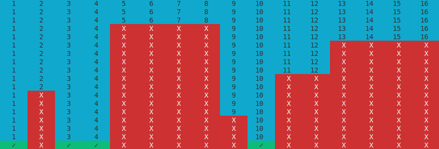

# Simple python combination bisect algorithm

## Use Cases

Let's say we have a program which has a list of dependencies, but we don't know which are necessary.

Program works by inputting an arbitrary list, and trying to run the program with only part of that list's items. It keeps track of the times it runs successfully and fails, narrowing down the minimum amount of items necessary to run the app.

Logic can be flipped to see for example which packages can be installed, or in gaming community which mods will work in a game.

## How algorithm works

It uses binary search to split list into 2 halves, then the remaining lists into halves, etc. Finished when narrowed down to exact elements.

How the algorithm behaves when something needs `1`, `3`, `4` and `10` to run successfully, each row is one iteration

It only works when behavior is monotonic, in the case of this graph there can't be any "overhangs". In that case once rejected (unnecessary) elements cannot be re-added into testing set.

See `example.py` for an example implementation.
